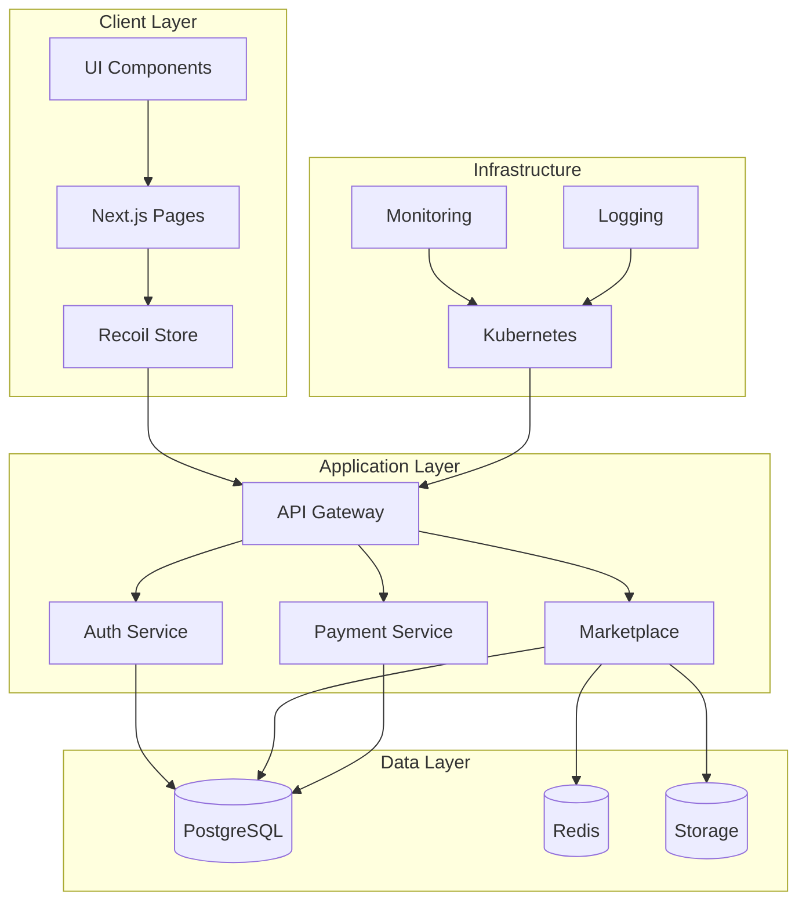
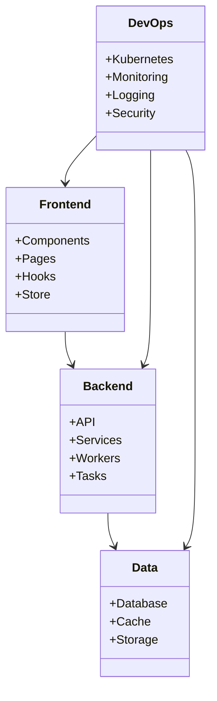
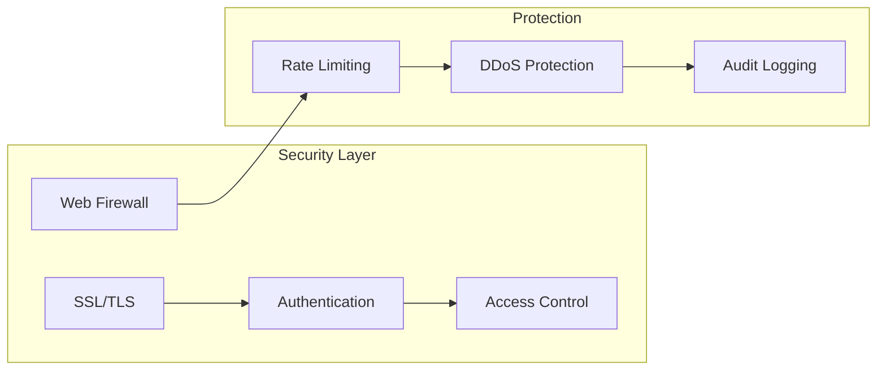
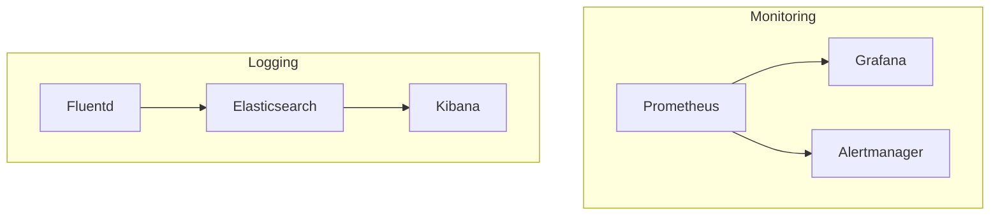
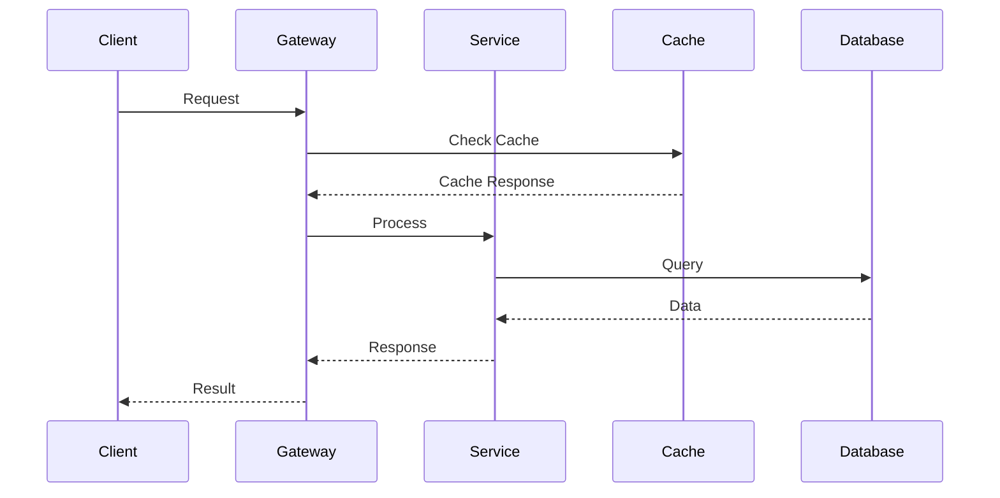

# AgriSmart Final Architecture

## System Architecture Overview

## Component Relationships

## Key Components

### Frontend Layer
- Next.js application
- Recoil state management
- React components
- Custom hooks
- API integration

### Application Layer
- API Gateway
- Authentication service
- Marketplace service
- Payment processing
- Task scheduling

### Data Layer
- PostgreSQL database
- Redis caching
- File storage
- Search indexing

### Infrastructure Layer
- Kubernetes clusters
- Docker containers
- Monitoring stack
- Logging system
- Security measures

## Security Architecture

## Monitoring Stack

## Application Flow

The architecture is designed for:
- High availability
- Horizontal scalability
- Security by design
- Performance optimization
- Easy maintenance
- Comprehensive monitoring