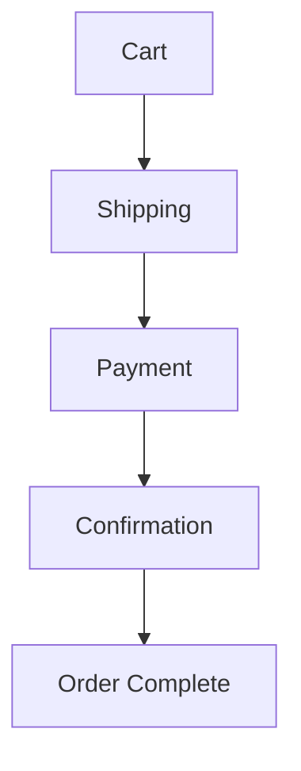

# AgriSmart Marketplace Module Documentation

## Overview
The marketplace module provides a complete e-commerce solution for agricultural products, enabling users to browse, purchase, and manage orders within the AgriSmart platform.

## Core Features

### 1. Product Management
- Product listing with filtering and sorting
- Category-based organization
- Stock management
- Vendor information display

### 2. Shopping Cart
- Real-time cart updates
- Persistent cart state
- Quantity management
- Price calculations
- Multi-vendor support

### 3. Checkout Process


#### Shipping
- Address collection and validation
- Multiple delivery options
- Address saving for future use
- Delivery cost calculation

#### Payment
- Multiple payment methods
- Secure card processing
- PayPal integration
- Bank transfer option

#### Order Confirmation
- Order summary
- Delivery information
- Email notifications
- Order tracking setup

## Technical Implementation

### State Management
```typescript
// Core state atoms
const cartState = atom<Cart>({
  key: 'cartState',
  default: {
    items: [],
    totalItems: 0,
    subtotal: 0,
    shipping: 0,
    tax: 0,
    total: 0
  }
})

// Computed selectors
const cartTotalsSelector = selector({
  key: 'cartTotalsSelector',
  get: ({ get }) => {
    const cart = get(cartState)
    // Calculate totals...
  }
})
```

### Component Architecture
- Modular component design
- Reusable UI elements
- Responsive layouts
- Loading states
- Error handling

### Data Flow
```
User Action → State Update → UI Update → API Call → State Sync
```

## Testing Coverage

### Unit Tests
- Component rendering
- State management
- Form validation
- Cart operations

### Integration Tests
- Checkout flow
- Payment processing
- Order management
- Error handling

### E2E Tests
- Complete shopping flow
- Cart persistence
- User interactions
- Edge cases

## Security Measures

### Payment Security
- Secure form handling
- PCI compliance preparation
- Token-based transactions
- SSL/TLS encryption

### Data Protection
- Input validation
- XSS prevention
- CSRF protection
- Rate limiting

## Performance Optimization

### State Management
- Selective re-rendering
- Computed values caching
- Lazy loading
- State persistence

### Asset Optimization
- Image optimization
- Code splitting
- Bundle optimization
- Dynamic imports

## Error Handling

### User Feedback
- Form validation errors
- Transaction failures
- Network issues
- Stock availability

### Recovery Mechanisms
- Auto-retry for failed requests
- Cart recovery
- Session restoration
- Error boundaries

## Integration Points

### Authentication System
- User session management
- Role-based access
- Secure checkout

### API Layer
- RESTful endpoints
- Type-safe requests
- Error handling
- Request caching

## Future Enhancements

### Planned Features
1. Advanced product search
2. Wishlist functionality
3. Subscription orders
4. Bulk purchasing

### Performance Improvements
1. Image lazy loading
2. Server-side rendering
3. API response caching
4. State persistence optimization

## Usage Guidelines

### Component Usage
```tsx
// Cart integration
import { useRecoilState } from 'recoil'
import { cartState } from '@/lib/store/marketplace.store'

function ProductActions() {
  const [cart, setCart] = useRecoilState(cartState)
  // Implementation...
}
```

### Hook Usage
```tsx
// Checkout flow
function CheckoutPage() {
  const { isAuthenticated } = useAuth()
  const cart = useRecoilValue(cartState)
  // Implementation...
}
```

## Troubleshooting

### Common Issues
1. Cart state sync issues
2. Payment processing errors
3. Form validation problems
4. Order completion failures

### Resolution Steps
1. Check authentication status
2. Verify cart state
3. Validate form data
4. Check API responses

## Maintenance

### Regular Tasks
- Monitor error rates
- Update payment methods
- Review security measures
- Optimize performance

### Updates
- Security patches
- Feature enhancements
- Bug fixes
- Performance improvements