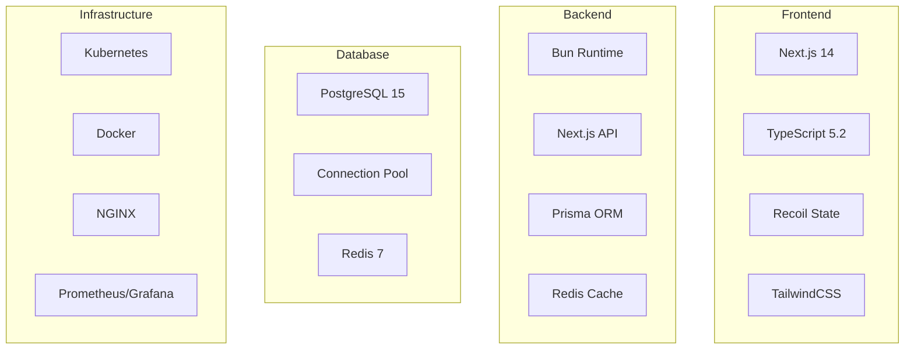
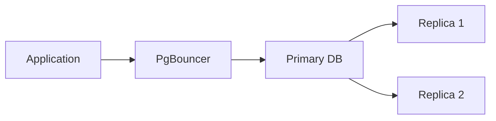
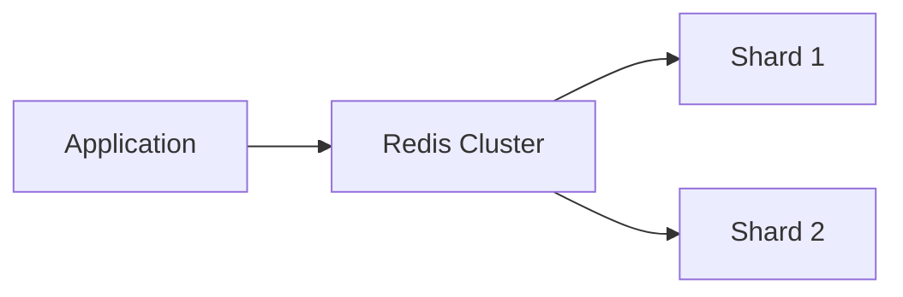
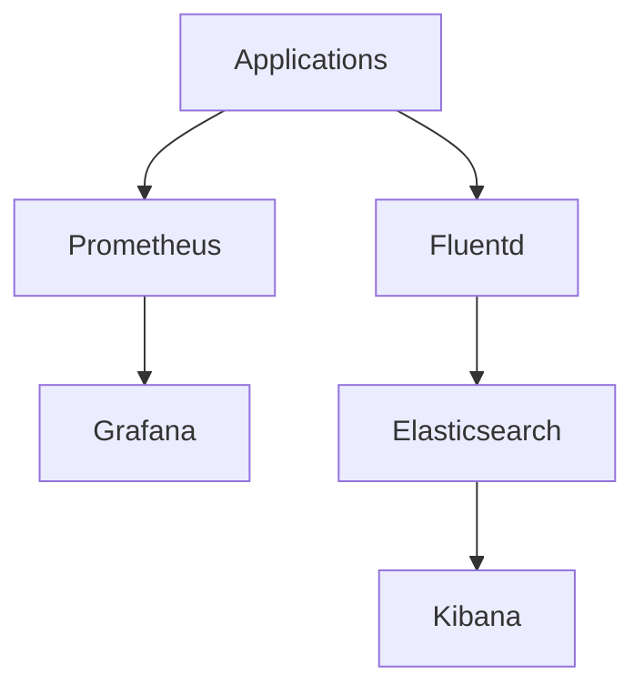
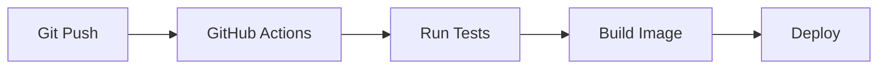

# AgriSmart Technical Stack

## Core Technologies

## Frontend Stack

### Core
- Next.js 14 with App Router
- TypeScript 5.2
- Recoil for state management
- TailwindCSS for styling

### Components & Libraries
- Custom design system
- React Hook Form + Zod
- Recharts for data visualization
- Date-fns for date handling
- Lucide icons

### Performance
- Built-in Next.js image optimization
- Dynamic imports for code splitting
- Web Vitals monitoring
- Bundle size analysis

## Backend Stack

### Core
- Bun runtime environment
- Next.js API Routes
- Prisma ORM
- Redis caching

### Security
- JWT authentication
- Bcrypt password hashing
- Helmet security headers
- Rate limiting implementation

### Storage
- AWS S3 integration
- Sharp image processing
- Secure file uploads

## Database Architecture

### Primary Database (PostgreSQL)

### Caching Layer (Redis)

## Infrastructure

### Container Orchestration
- Kubernetes for orchestration
- Docker containers
- NGINX load balancer
- GitHub Container Registry

### Monitoring Stack

## Development Tooling

### CI/CD Pipeline

### Testing Framework
- Vitest for unit testing
- Playwright for E2E tests
- React Testing Library
- MSW for API mocking

### Code Quality
- ESLint configuration
- Prettier formatting
- Husky git hooks
- Conventional commits

## Version Management
- Git for version control
- GitHub for collaboration
- Trunk-based development
- Semantic versioning

## Documentation
- OpenAPI specification
- TypeDoc for API docs
- Storybook for components
- Architecture diagrams

## Performance Metrics
- Lighthouse scores >90
- Core Web Vitals pass
- API response <100ms
- Cache hit ratio >90%

## Security Measures
- HTTPS enforcement
- CORS policies
- XSS protection
- CSRF prevention
- Rate limiting
- Input validation
- Output sanitization